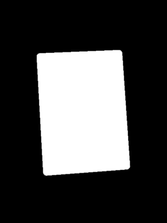

# Magic The Gathering - Cards Image Segmentation

This project provides tools for generating Magic The Gathering Cards image segmentation machine learning model.

# Glossary

- **Magic The Gatering** Good card game for the cool people!
- **Machine Learning** A field of artificial intelligence
- **Python** Programing Language
- **Blender** 3D modeling and rendering Open Source software
- **BlenderProc2** A procedural Blender pipeline (tool) for photorealistic rendering
- **HDRI** High Dynamic Range Image, for creating realistic environments
- **Skryfall** MTG card database
- **Polyhaven** Website for 3d assets
- **API** An interface for talking with websites/apps
- **ONNX** Open Neural Network Exchange 
- **GAN** Generative Adversarial Network (IA image generators for example)

# The Plan

- [x] Create MTG Cards Syntetic Dataset Generator based on 3d redering, and generate the first version of this dataset. 

- [ ] Create the machine learning training scrips and train the model

- [ ] Transform to ONNX

- [ ] Crate a web example for runing the model in web

Others: [WIP] Expand the dataset with a generative network like flux or Stable diffusion

# Hardware/Software Requirements

- 16 gb of ram or more (recomended)
- 10 GB of hard disk space (or more)
- A cuda 12 capable GPU (Nvidia) (others may be can be used, not tested)
- Nvida Cuda 12 and a working pytorch enviroment (google it)
- Ubuntu 24.04 is recomended

## Step 1 - MTG Cards Syntetic Dataset Generator (`dataset_generator/`)

### 1. Reference Dataset Downloader (`01_download_references.py`)
Downloads MTG card reference images from Scryfall API.

### 2. Reference Dataset Downloader (`02_dowload_hdrs.py`)
Downloads realistic environments and lightings (HDRI) from Polyhaven API.

### 3. Synthetic Image Generator (`03_generate_synthetic_dataset.py`)
BlenderProc2-based synthetic image generator that creates realistic MTG card images with segmentation masks.

#### Features:
- **Photorealistic rendering** using HDRI environments
- **Precise card geometry** with rounded corners
- **Random transformations** (0-15° rotation on all axes)
- **Variable positioning** (40-70% image coverage)
- **Automatic segmentation masks** generation

#### Examples:

  
 


#### Quick Start:

```bash
# Create and activate python virtual enviroment
python3 -m venv venv
source venv/bin/activate

# Upgrade pip package manager 
python -m pip install --upgrade pip

# Install dependencies
python -m pip install -r requirements.txt
blenderproc pip install tqdm>=4.66.0

# Download reference images
cd dataset_generator
python 01_download_references.py

# Download enviroments
python 02_dowload_hdrs.py

# Generate synthetic images
cd ..
blenderproc run dataset_generator/03_generate_synthetic_dataset.py

# For large datasets, use synthetic_dataset_anti_leak.py (restar the 03_generate_synthetic_dataset script every X minutes)
python synthetic_dataset_anti_leak.py -t 5

# blenderproc recomend not redering too many imgs in a single bender instance. I read this after the implementation...
# So... i make a dirty hack (it works!) 
```

Note: In Windows, if blenderproc is not in your path, you can try (examples):

    python -m blenderproc pip install tqdm>=4.66.0
    python -m blenderproc run dataset_generator/03_generate_synthetic_dataset.py

# Developer Notes

This tools where created using: 

    VSCode
    Cline - AI Dev Assistant / VSCode extension
    Copilot - IA Dev Asistant (provider) / VSCode extension
    Claude 4 - IA Model
    Gemini 2.5 pro - IA Model
    Python / Python Debugger / Pylance - VSCode extensions

See [Synthetic Image Generator](dataset_generator/generate_synthetic.md) documentation.  
Original repo [link](https://github.com/diegovazquez/mtg_image_segmentation).  
Pre Generated Dataset [link](https://huggingface.co/datasets/dhvazquez/mtg_synthetic_cards_semantic_segmentation/).  
